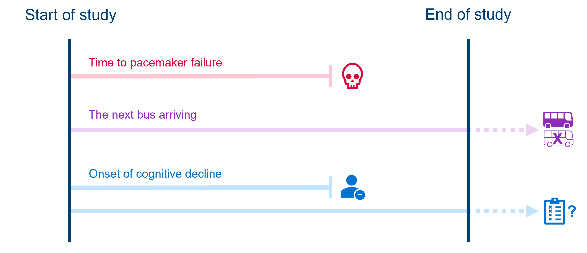
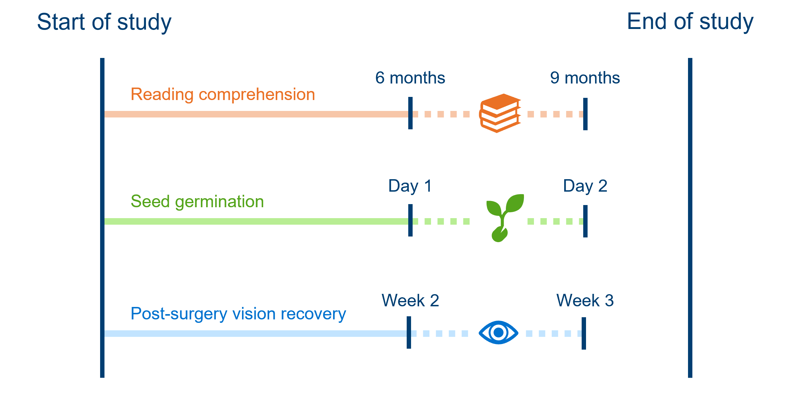

```{r, load packages}
#| echo: false
#| message: false
#| results: hide
source(file = "setup_files/setup.R")
```

```{python, import libraries}
#| echo: false
#| message: false
#| results: hide
exec(open('setup_files/setup.py').read())
import shutup;shutup.please()
```

This section of the course materials explains the motivation for survival analysis, known more generally as time-to-event analysis, as a unique or specialised statistical method.

We'll get familiar with what makes time-to-event data different from other datasets, and what we'll need to do to treat them differently.

## Libraries and functions

:::: {.callout-note collapse="true"}
## Click to expand

::: {.panel-tabset group="language"}
## R

```{r, load libraries}
#| eval: false
# load the required packages for fitting & visualising
library(tidyverse)
library(survival)
library(survminer)
```

## Python

```{python, import packages}
#| eval: false
import numpy as np
from lifelines import KaplanMeierFitter
```
:::
::::

Why do we require specialist modelling techniques for these sorts of data?

The response variable is always "time until \[insert event here\]".

We could try to treat that as a continuous response and fit a linear model, but we would run into issues, for a couple of reasons - which we'll unpack in more detail now.

## Skewed & positive data

Firstly, the distribution of durations/times to event does not match what we would expect in a classic linear model. Specifically:

-   Values are bounded at/cannot be below 0
-   There will be a lot of short durations, and a smaller number of very long ones, creating skew

### Hospital stays dataset

Let's have a look at this unusual distribution in practice, with a real time-to-event dataset.

This dataset is from a clinical study in which the time to discharge from a hospital was measured for a number of patients. There are 200 patients in total in the dataset.

::: {.panel-tabset group="language"}
## R

```{r, read discharge dataset}
#| echo: false
hospital_stays <- read_csv("data/hospital_stays.csv") %>%
  dplyr::select(time, discharged)
```

```{r, head discharge dataset}
head(hospital_stays)
```

## Python

```{python, loading hosp dataset}
#| echo: false
hospital_stays = pd.read_csv("data/hospital_stays.csv")[["time","discharged"]]
```

```{python, head hosp dataset}
hospital_stays.head()
```
:::

When we plot the time-to-discharge on a histogram, we can see a strong right-skew (a long tail going in the positive direction).

This reflects the fact that a lot of people will be discharged within a few days, since most people who are admitted to hospital thankfully aren't seriously unwell. A small fraction of the patients studied, however, are admitted for much more serious reasons and stay a lot longer.

The histogram is also bounded at 0 - all durations have to be positive.

::: {.panel-tabset group="language"}
## R

```{r, hist hosp event times}
ggplot(hospital_stays, aes(x = time)) +
  geom_histogram(bins = 20)
```

## Python

```{python, plot hist hosp events}
plt.clf()
plt.hist(hospital_stays["time"], bins = 20)
plt.show()
```
:::

## Censoring

Perhaps the most important and unique thing about time-to-event data is that it will often be censored - meaning we have incomplete information.

::: callout-warning
#### We can't just exclude censored individuals!

If we were to drop these individuals from our study, we would probably get a pessimistic impression of the survival rate, which is why we need statistical methods that can account for right-censoring (like the Kaplan-Meier estimator, which we'll see in the next chapter).
:::

In this chapter, we'll talk about the two most common types of censoring.

In later (bonus) chapters, we'll introduce other types of "missingness" in time-to-event data which are much less common, in case you come across those in your own research or reading.

### Right-censoring

The most common form of censoring in time-to-event data is right-censoring. This is when an individual in our study still hasn't experienced our event of interest, at the point where we stop observing them.

This tends to happen because either:

-   The study ends before the event happens
-   The individual drops out of the study or is lost to follow-up
-   The individual experiences some competing event (the event of interest becomes impossible)

Importantly, we don't know if or when the individual ever experiences the event after we stop tracking them. All we know is that they didn't experience it while we were observing.

For example:

-   In a study assessing time to **failure of pacemaker** devices, a patient dies of other causes (competing event occurs) before their device fails.
-   A person gives up waiting at a bus stop before the **next bus arrives** (i.e., the "study" ends). There is no way of knowing if/when a bus next arrived at the stop.
-   While monitoring participants for signs of **cognitive decline**, a participant decides to withdraw their consent from the study (drops out).
-   Meanwhile, another participant being monitored for cognitive decline shows no indication by the time the longitudinal study ends; there's no way if knowing if/when their cognitive scores might have dropped after the study ended.



### Interval-censoring

Interval-censoring is the next most common form of censoring. It happens when we don't know the exact time an event occurred, but we do know what window it fell within.

This usually happens in studies where we aren't constantly observing individuals. For example:

-   Every 3 months, children are tested to see whether they have reached a minimum level of **reading comprehension**. A child fails the test at the 6 month mark and passes at the 9 month mark of the study; we know that they reached minimum reading comprehension between those assessments, but not precisely when.
-   Each morning, greenhouse staff check to see if **seeds have germinated**. If they see a new seedling one morning, we don't know exactly when it germinated, only that it must've been sometime since yesterday morning and this morning.
-   Post-surgery, patients' **vision recovery** is assessed weekly, and they wear an eye-patch in between assessments. At week 2, their vision is blurry; at week 3, their vision is clear. Their doctor can't be sure exactly when in the last week, their vision fully recovered.



## Formatting survival data

In order to run an analysis in R or Python (using the `survival` or `lifelines` packages, as we will be doing on this course), the data first need to be in the correct format.

Let's look at the first 20 rows (of 200) from the `hospital_stays` dataset introduced above.

::: {.panel-tabset group="language"}
## R

```{r, head discharge dataset again}
head(hospital_stays, 20)
```

## Python

```{python, head hosp dataset again}
hospital_stays.head(21)
```
:::

At minimum, the dataframe must contain a column for the `time` (or "duration followed"), and a column to record whether the `event` occurred (binary).

-   So, if a row records a duration of `12` and an event of `1`, this means that the event of interest (discharge from hospital) occurred at 12 days.

-   If a row records a duration of `30` and an event of `0`, this means that the individual did not experience the event, and was instead censored, at 30 days. This means they dropped out of the study for some reason (e.g., died or withdrew consent).

-   Some patients have a duration of `60.5` days and an `event` marked `0`, because they were right-censored due to the study ending.

#### Events & individuals

Each row of the `hospital_stays` data frame represents a unique patient who has been admitted to the hospital.

Here are some other examples of what might count as "individuals" in a time-to-event study.

| The event of interest is:           | Each row is:           |
|-------------------------------------|------------------------|
| Death (following disease diagnosis) | A patient              |
| Machine failure in a factory        | A machine              |
| Catching a fish                     | A fish                 |
| Return to sport after injury        | An athlete             |
| Flower blooming                     | A flower (or a plant)  |
| Being awarded a degree/graduation   | A student              |
| Eruption of a new tooth             | A tooth (or a child)   |
| Wound healing/closure               | A wound (or a patient) |

Note that each row of the dataset needs to be independent (not influenced by other rows in the dataset). If this isn't true in our data, we'd need to fit a more complex model that takes into account the non-independence.

#### Additional columns for predictor(s)

The `hospital_stays` dataset presented above isn't the full version - it actually contains some predictor variables.

These exist as additional columns in the dataset. For each unique row (in this case, each unique patient), the researcher also recorded the patient's `age`, biological `sex`, whether they received `surgery`, and whether they had a `weekend_admission` (vs weekday).

::: {.panel-tabset group="language"}
## R

```{r, read discharge dataset again2}
#| echo: false
hospital_stays <- read_csv("data/hospital_stays.csv")
```

```{r, head discharge dataset again2}
head(hospital_stays, 20)
```

## Python

```{python, loading hosp dataset again2}
#| echo: false
hospital_stays = pd.read_csv("data/hospital_stays.csv")
```

```{python, head hosp dataset again2}
hospital_stays.head(21)
```
:::

In the upcoming chapters, we'll look at how to determine whether these predictor variables have an impact on the time spent in hospital before discharge.

## Summary

Survival data, or time-to-event data, have some unique features that require a dedicated analysis technique.

These features include censoring (a type of missing data), and values of the response variable being exclusively positive and typically right-skewed.

::: callout-tip
#### Key Points

-   The response variable in a time-to-event analysis is the duration or time until an event of interest (e.g., death) occurred
-   This response variable is always positive (\>0) and typically right-skewed
-   Some data points are censored, meaning that we don't know if/when the event of interest occurred
-   The most common type of censoring is right-censoring, when an individual has not experienced the event of interest but is no longer followed by researchers (due to the end of the study, or dropping out)
-   The other common type of censoring is interval-censoring, when the researcher does not know the precise time an event occurred, but instead only knows the window/interval
:::
