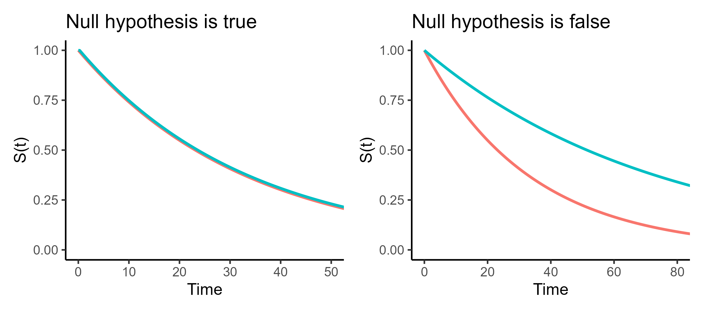
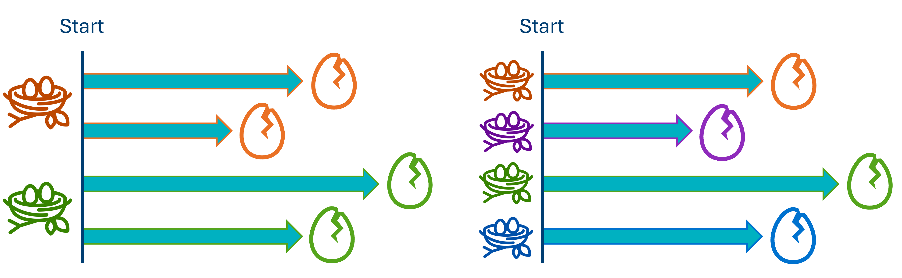
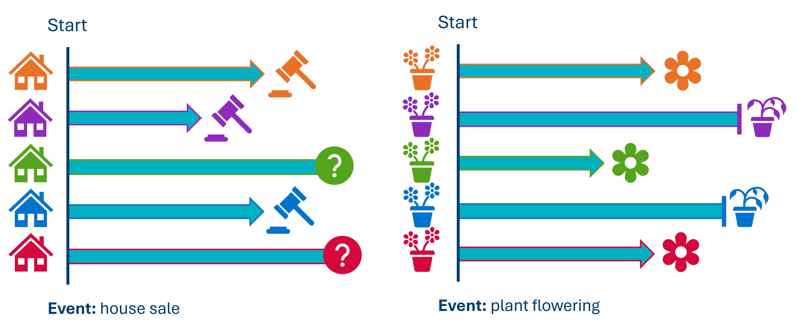

```{r}
#| echo: false
#| message: false
#| results: hide
source(file = "setup_files/setup.R")
```

```{python}
#| echo: false
#| message: false
#| results: hide
exec(open('setup_files/setup.py').read())
import shutup;shutup.please()
```

```{python, median plotting helper function}
#| echo: false
#| message: false
#| results: hide
def add_median_markers(fitters, ax=None, short_lines=True, colors=None):
    
    """
    Add median survival markers to a survival plot.

    Parameters:
    - fitters: A single fitter or a list of fitted lifelines KaplanMeierFitter models.
    - ax: Optional matplotlib Axes to draw into.
    - short_lines: If True, draw short lines. If False, draw full-width/height lines.
    - colors: Optional list of colors for the markers (must match number of fitters).
    """
    
    if not isinstance(fitters, list):
        fitters = [fitters]

    if ax is None:
        ax = plt.gca()

    if colors is None:
        # Cycle through default matplotlib colors
        colors = plt.rcParams['axes.prop_cycle'].by_key()['color']

    for i, kmf in enumerate(fitters):
        median = kmf.median_survival_time_
        color = colors[i % len(colors)]
        label = getattr(kmf, 'label', f'Group {i + 1}')

        if short_lines:
            # Short vertical and horizontal lines
            ax.plot([median, median], [0, 0.51], linestyle=':', color=color, label=f'{label} Median: {median:.2f}')
            ax.plot([0, median], [0.5, 0.5], linestyle=':', color=color)
        else:
            # Full lines across the plot
            ax.axvline(median, linestyle='--', color=color, label=f'{label} Median: {median:.2f}')
            ax.axhline(0.5, linestyle=':', color=color)

    ax.legend()
```

In this chapter, we'll look into how, when and why to use the log-rank test to compare stratified (grouped) survival curves to one another.

## Libraries and functions

::: {.panel-tabset group="language"}
## R

```{r, load libraries}
#| eval: false
# load the required packages for fitting & visualising
library(tidyverse)
library(survival)
library(survminer)
```

## Python

```{python, import packages}
#| eval: false
import numpy as np
import pandas as pd
from lifelines import *
import matplotlib.pyplot as plt
```
:::

## The log-rank (Mantel-Cox) test

We use this test in situations where we have a **single categorical predictor** in our dataset, and would like to find out whether two survival curves are significantly different from each other.

You might find it useful to think of the log-rank test as an analogue of a two-sample t-test, but for time-to-event data specifically.

The null hypothesis:

- The two groups don't differ in how likely they are to experience the event over time;

- i.e., in the underlying population, the **true survival curves are identical.**

So, if our p-value falls under the significance threshold, our data are very unlikely to have occurred just by chance, giving some evidence that a difference does exist.



## Assumptions of a log-rank test

Like all statistical tests, before we jump in and start calculating things, we need to consider some key statistical assumptions first.

If these aren't met, the log-rank test won't actually help us answer our research question.

### Assumption 1: Independent observations {#sec-independence}

An "observation" = a unique row in the raw dataset, representing a unique individual in the study.

"Independent" means that none of the individuals are affected by any other individuals in the study, or artificially similar to them.

For example, let's look at the example of bird's eggs hatching, illustrated below.

The event of interest is an egg hatching. If, however, we include multiple eggs from the same nest, those eggs are not independent of one another - they're artificially similar because they were laid at the same time, and may affect each other through physical means (e.g., shared warmth/contact).

To make it truly independent, we can only include one egg per nest (e.g., we might decide to use the first egg).



Other common sources of non-independence would include (but are not limited to!):

- Repeated measures (recording multiple rows/events of interest per individual)
- Matched/paired designs
- Natural "clusters" or "nesting", such as patients within hospitals, or students within schools
- Genetic relatedness, e.g., using animals from the same litter

::: {.callout-tip collapse="true" icon="false"}
#### Checking for independence

You might find some people online telling you about various quantitative tests for independence. I'm not going to do that, because the only reliable check for independence is a good understanding of your experimental design.

If you can think of any ways of grouping together the rows of your dataset, then that's an indication that you have some dependency.
:::

::: {.callout-warning collapse="true" icon="false"}
#### What if independence is violated?

You may need to consider something like a mixed effects Cox regression model. This is a combination of Cox regression (which we talk about later in this course) and mixed effects modelling (which needs a whole course all of its own).
:::

### Assumption 2: Non-informative censoring {#sec-non-informative-censoring}

The likelihood of censoring should not be related to the likelihood of experiencing the event of interest.

Phrased another way: the individuals who are censored are assumed to have had the same underlying time-to-event distribution if they had remained in the study, i.e., the same likelihood of experiencing the event, as those who weren't censored.



The figure above shows two examples of informative censoring, which would violate the assumption.

1.  **House sales**. Houses that are less likely to sell/take longer to sell, are also more likely to be removed from the housing market by their owners. In other words, the length of time taken for the house to sell, is related to the likelihood that the house is removed from the study.
2.  **Flowering plants**. Plants that are diseased or growing poorly will take longer to flower, but they are also more likely to be removed from the study entirely (e.g., by the gardener throwing them away).

::: {.callout-tip collapse="true" icon="false"}
#### Checking for non-informative censoring

The most obvious clue will be unequal rates of censoring between groups. This is a sign that censoring is not happening at random.

You will also need to consider your experimental design carefully.
:::

::: {.callout-warning collapse="true" icon="false"}
#### What if censoring is informative?

You could consider a competing risks model.
:::

### Desirable: Proportional hazards {#sec-proportional-hazards-1}

The hazard ratio - i.e., the increased risk of experiencing the event in group 1 versus group 2 - should ideally stay consistent over time.

In our `hospital_stays` dataset, proportional hazards would mean that if non-surgical patients are 2x more likely than surgical patients to be discharged on day 3, they would also be 2x more likely to get discharged on day 30 (and every day in between).


::: {.callout-tip collapse="true" icon="false"}
#### Checking for proportional hazards

There a handful of methods available to you:

- Inspecting the Kaplan-Meier curves; see the figure above for some examples
- Creating log-log plots; you want the lines to be roughly parallel
- Checking the Schoenfeld residuals

We'll unpack some of these methods in more detail in later chapters when we look at Cox regression, where proportional hazards is a formal assumption.
:::

::: {.callout-warning collapse="true" icon="false"}
#### What if hazards aren't proportional?

The log-rank test becomes less powerful or sensitive (less likely to detect true differences).

It's still *valid*, however. Remember that proportional hazards aren't a formal assumption of the log-rank test.
:::

## Running a log-rank test

To practice implementing the test, let's return to the `hospital_stays` dataset, which we plotted survival curves for in the last chapter.

Specifically, let's focus on the `sex` and `surgery` predictors from the dataset.

::: {.panel-tabset group="language"}
## R

```{r, read hosp_stays}
hospital_stays <- read_csv("data/hospital_stays.csv")

head(hospital_stays)
```

## Python

```{python, load hosp_stays}
hospital_stays = pd.read_csv("data/hospital_stays.csv")

hospital_stays.head()
```
:::

#### Log-rank test by surgery

When we stratified by `surgery` in the previous chapter, we got curves that looked like this:

::: {.panel-tabset group="language"}
## R

```{r, recreate surgery curves}
#| echo: false
hosp_curve_surgery <- survfit(Surv(time, discharged) ~ surgery, 
                              data = hospital_stays)

ggsurvplot(hosp_curve_surgery,
           conf.int = TRUE,
           surv.median.line = "hv")
```

## Python

```{python, recreate strat-surgery curves}
#| echo: false
T = hospital_stays["time"]
E = hospital_stays["discharged"]

# Subset of the dataset that received surgery
surg = (hospital_stays["surgery"] == 1)

# Kaplan Meier fit for surgical data subset
surg_hosp = KaplanMeierFitter()
surg_hosp.fit(T[surg], event_observed=E[surg], label="Surgical patients")

# Kaplan Meier fit for non-surgical data subset
ns_hosp = KaplanMeierFitter()
ns_hosp.fit(T[~surg], event_observed=E[~surg], label="Non-surgical patients")

plt.clf()

# Initialise a plot to capture both of the curves
fig, ax = plt.subplots()

# Add the two curves, one at a time
surg_hosp.plot_survival_function(ax = ax)
ns_hosp.plot_survival_function(ax = ax)

# Add the median markers for both curves
add_median_markers([surg_hosp, ns_hosp], ax = ax)

plt.show()
```
:::

We determined that the median survival times for surgical and non-surgical patients weren't identical. Surgical patients spend longer in hospital on average.

Now, let's add a p-value to our weight of evidence, to see whether that difference is statistically significant.

::: {.panel-tabset group="language"}
## R

In the `survival` package, this process is as simple as changing the function from `survfit` to `survdiff`.

None of the rest of the syntax changes. We still use a survival object `Surv(time, discharged)` as our response, and the `~ surgery` formula to make our predictor variable clear.

```{r, log rank surgery}
survdiff(Surv(time, discharged) ~ surgery, data = hospital_stays)
```

In the output, alongside the statistic and p-value, we are shown:

- the `n` sample size in each group
- the observed number of events (discharges from hospital) in each group
- what the expected number of events **would** be, if there were no effect of `surgery`

## Python

There is a dedicated `logrank_test` function in the `lifelines` package.

We have to provide the following arguments:

- The set of times `T` for the `surgery = 1` group
- The set of times `T` for the `surgery = 0` group
- The events (versus censoring) `E` for the `surgery = 1` group
- The events `E` for the `surgery = 0` group

```{python, log-rank for surgery}
from lifelines.statistics import logrank_test

T = hospital_stays["time"]
E = hospital_stays["discharged"]

# Subset of the dataset that received surgery
surg = (hospital_stays["surgery"] == 1)

# Run the log-rank test
results = logrank_test(T[surg], T[~surg], E[surg], E[~surg])

results.print_summary()
```

You can access the exact p-value with `results.p_value`:

```{python, extract p for surgery log-rank}
results.p_value
```
:::

A chi-square ($\chi^2$\$\\chi\^2\$) statistic has been calculated to summarise the difference between the two groups.

The associated p-value, in this case, tells us that the likelihood of observing two curves that are this (or more) different from each other, if `surgery` really had no effect on time-to-discharge in the hospital, is very low.

This is additional evidence for us that `surgery` probably does affect how quickly a patient can expect to be discharged.

For a final step, let's add those p-values onto our plot:

::: {.panel-tabset group="language"}
## R

There are two additional arguments in `ggsurvplot` that you can make use of.

The `pval` argument tells the function to compute and add a p-value. The `pval.method` argument adds a text label to clarify what type of test was performed to get the p-value.

```{r, surgery curves with pval}
ggsurvplot(hosp_curve_surgery,
           conf.int = TRUE,
           surv.median.line = "hv",
           pval = TRUE, pval.method = TRUE)
```

## Python

You have to add the p-value manually in `lifelines`.

First, save the p-value from the `results` output of the log-rank test. Then, annotate the plot with text.

You might need to adjust the x/y positions, depending on the exact shape of your curve(s).

```{python, strat-surgery curves with pval}
# Kaplan Meier fit for surgical data subset
surg_hosp = KaplanMeierFitter()
surg_hosp.fit(T[surg], event_observed=E[surg], label="Surgical patients")

# Kaplan Meier fit for non-surgical data subset
ns_hosp = KaplanMeierFitter()
ns_hosp.fit(T[~surg], event_observed=E[~surg], label="Non-surgical patients")

# Initialise a plot to capture both of the curves
plt.clf()
fig, ax = plt.subplots()

# Add the two curves, one at a time
surg_hosp.plot_survival_function(ax = ax)
ns_hosp.plot_survival_function(ax = ax)

# Add the median markers for both curves
add_median_markers([surg_hosp, ns_hosp], ax = ax)

# Add the p-value
pval = results.p_value
ax.text(0.6, 0.6, f"Log-rank p = {pval:.3g}", transform=ax.transAxes)

plt.show()
```
:::

::: {.callout-tip collapse="true"}
#### How is the log-rank statistic calculated?

Observed vs expected for each time point
:::

#### Log-rank test by sex

In contrast, let's run a log-rank test for a predictor variable where we didn't see much visual difference in the curves: biological `sex` of the patient.

::: {.panel-tabset group="language"}
## R

```{r, log rank sex}
survdiff(Surv(time, discharged) ~ sex, data = hospital_stays)
```

## Python

```{python, log-rank for sex}
# Subset of the dataset that are female
fem = (hospital_stays["sex"] == 0)

# Run the log-rank test
results = logrank_test(T[fem], T[~fem], E[fem], E[~fem])

results.print_summary()
```
:::

We see now that the chi-square statistic is much smaller, and the p-value much larger.

This suggests that the likelihood of seeing curves with this much difference (or greater), if there really was no difference between male and female patients, is actually quite high.

In other words: the small difference we're observing is quite likely to have happened by chance.

Last but not least, let's visualise the curves to help us contextualise the p-value a little better:

::: {.panel-tabset group="language"}
## R

```{r, sex curves with pval}
hosp_curve_sex <- survfit(Surv(time, discharged) ~ sex, data = hospital_stays)

ggsurvplot(hosp_curve_sex,
           conf.int = TRUE,
           surv.median.line = "hv",
           pval = TRUE, pval.method = TRUE)
```

## Python

```{python, strat-sex curves with pval}
# Kaplan Meier fit for surgical data subset
fem_hosp = KaplanMeierFitter()
fem_hosp.fit(T[fem], event_observed=E[fem], label="Female patients")

# Kaplan Meier fit for non-surgical data subset
male_hosp = KaplanMeierFitter()
male_hosp.fit(T[~fem], event_observed=E[~fem], label="Male patients")

# Initialise a plot to capture both of the curves
plt.clf()
fig, ax = plt.subplots()

# Add the two curves, one at a time
fem_hosp.plot_survival_function(ax = ax)
male_hosp.plot_survival_function(ax = ax)

# Add the median markers for both curves
add_median_markers([fem_hosp, male_hosp], ax = ax)

# Add the p-value
pval = results.p_value
ax.text(0.6, 0.6, f"Log-rank p = {pval:.3g}", transform=ax.transAxes)

plt.show()
```
:::

## Best practices for reporting

Chances are that if you're running a log-rank test, you'll likely want to report it. Here are some general guidelines to follow when you do.

+---------+------------------------------------------------------------------------------------------------------------------------------------------------------------------------------------------------------------+
|         |                                                                                                                                                                                                            |
+=========+============================================================================================================================================================================================================+
| ✓       | **Visualise the survival curves**                                                                                                                                                                          |
+---------+------------------------------------------------------------------------------------------------------------------------------------------------------------------------------------------------------------+
|         | A single significance test by itself tells a reader very little. It doesn't capture important details like sample size or direction of effect (e.g., which group is more at risk than the other).          |
|         |                                                                                                                                                                                                            |
|         | If a log-rank test is important enough to your central thesis that you're choosing to include it in your writing, then it's also important enough to visualise the survival curves that you compared.      |
+---------+------------------------------------------------------------------------------------------------------------------------------------------------------------------------------------------------------------+
| ✓       | **Comment on assumption-checking**                                                                                                                                                                         |
+---------+------------------------------------------------------------------------------------------------------------------------------------------------------------------------------------------------------------+
|         | You don't have to describe or show a full set of diagnostic plots in-text - that's probably overkill (if you're a very thorough person, you can put them in supplementary materials).                      |
|         |                                                                                                                                                                                                            |
|         | But, you should at least state the assumptions of the test, the fact that you checked them, and how well you believe they are met.                                                                         |
|         |                                                                                                                                                                                                            |
|         | There are a few reasons why:                                                                                                                                                                               |
|         |                                                                                                                                                                                                            |
|         | 1.  Hold yourself accountable - this will make sure you do actually think about the assumptions                                                                                                            |
|         | 2.  Transparency - it helps readers determine how confident they feel in the appropriateness of your log-rank test(s)                                                                                      |
|         | 3.  Setting a good example - researchers often follow statistical practice they learn from their peers' publications; you have an opportunity to set a good trend!                                         |
+---------+------------------------------------------------------------------------------------------------------------------------------------------------------------------------------------------------------------+
| ✓       | **Consider the problem of multiple comparisons/false positives**                                                                                                                                           |
+---------+------------------------------------------------------------------------------------------------------------------------------------------------------------------------------------------------------------+
|         | If you are doing a large number of log-rank tests, remember that the overall probability that at least one of them will give you a false positive result is higher than if you only did one log-rank test. |
|         |                                                                                                                                                                                                            |
|         | In situations where you need to run loads of tests, consider whether correcting for multiple comparisons might be needed, to increase confidence in your conclusions.                                      |
+---------+------------------------------------------------------------------------------------------------------------------------------------------------------------------------------------------------------------+
| ✓       | **Don't run/report log-rank tests unless they address your hypotheses**                                                                                                                                    |
+---------+------------------------------------------------------------------------------------------------------------------------------------------------------------------------------------------------------------+
|         | This is maybe the most important "best practice" of them all!                                                                                                                                              |
|         |                                                                                                                                                                                                            |
|         | Never do statistical analyses for the sake of sprinkling in some extra p-values. At best, this makes your overall point less clear. At worst, it's p-hacking.                                              |
|         |                                                                                                                                                                                                            |
|         | Only run tests that will actually address the research questions you had in mind when you designed the study in the first place.                                                                           |
+---------+------------------------------------------------------------------------------------------------------------------------------------------------------------------------------------------------------------+

## Exercises

### Mechanical parts failures (again) {#sec-exr_parts-log-rank}

::: callout-exercise


Let's return to the dataset from an exercise in [the previous chapter](#sec-exr_parts), `parts.csv`.

Is there a significant difference in survival probabilities over time between parts made by manufacturers A versus B?

*Note: there is no worked answer for this exercise, but feel free to compare your result to your neighbours!*
:::

### Fruit bowl {#sec-exr_fruit-bowl-2curves}

:::::::: callout-exercise


Read in the `fruit_bowl.csv` dataset.

A curious customer recorded how long it took for their fresh fruit to go off.

They want to know whether this differed between their two favourite fruits, bananas and oranges, while accounting for the fact that some fruits are eaten (censored) before they go off.

You should:

- Visualise the data
- Find the median survival time for each fruit (do you notice any issues?)
- Run a log-rank test, to determine whether this trend reflects a significant difference

::::::: {.callout-answer collapse="true"}
##### Answers

Let's read in and visualise our data first.

(Just for fun, I'm going to change the colours of the curves to match the fruits; this is optional, or you can set different colours, especially if you find the lack of contrast difficult!)

::: {.panel-tabset group="language"}
## R

```{r, fruitbowl survival curve}
#| message: false
fruit_bowl <- read_csv("data/fruit_bowl.csv")

fruit_curve <- survfit(Surv(time, gone_off) ~ fruit, data = fruit_bowl)

ggsurvplot(fruit_curve,
           conf.int = TRUE,
           palette = c("darkorange3", "gold"))
```
:::

The eye test would seem to imply that there is a difference, with bananas generally being quicker to go off.

We can examine the medians:

::: {.panel-tabset group="language"}
## R

```{r, print fruitbowl surv object}
fruit_curve
```
:::

::: callout-warning
##### Ah - what's happened here?

We're getting an `NA` value for the oranges; why is this?

Well, remember what the median represents: the time taken for 50% of the individuals in that group to experience the event.

In this dataset, we never reach a point where 50% of the oranges have gone off, and so that number can't be estimated.

The good news is that we're not prohibited from running the log-rank test in this case. Both groups reaching 50% survival is not one of our assumptions.

In other words: it's still possible to compare the overall survival curves, even if we can't compare the medians.
:::

Let's run the log-rank test.

::: {.panel-tabset group="language"}
## R

```{r, logrank fruitbowl}
survdiff(Surv(time, gone_off) ~ fruit, data = fruit_bowl)
```
:::

The p-value falls below our significance threshold, and so here we would reject the null hypothesis.

In other words, there is evidence to suggest that oranges and bananas do have distinct survival curves in the population, with bananas typically going first.
:::::::

As a bonus - and to carry you into the next chapter, where we'll revisit a version of this dataset again - are you worried about any of the assumptions of this log-rank test?
::::::::

### Practising assumption-checking {#sec-exr_assumptions}

:::: callout.exercise


Think through the following examples, and consider whether the assumptions of independence and/or non-informative censoring are met.

+---------+---------------------------------------------------------------------------------------------------------------------------------+
|         |                                                                                                                                 |
+=========+=================================================================================================================================+
| 🍷      | **Wine bottles**                                                                                                                |
|         |                                                                                                                                 |
|         | A wine collector records each time a wine bottle in their cellar develops a fault, e.g., a crack.                               |
|         |                                                                                                                                 |
|         | - Event of interest: fault developing                                                                                           |
|         | - Predictor: red vs white wine                                                                                                  |
+---------+---------------------------------------------------------------------------------------------------------------------------------+
| 🔋      | **Battery life**                                                                                                                |
|         |                                                                                                                                 |
|         | The battery life on a number of personal devices is tested, by continually using them without plugging them in until they fail. |
|         |                                                                                                                                 |
|         | - Event: losing charge (dropping to 0%)                                                                                         |
|         | - Predictor: laptop vs phone                                                                                                    |
+---------+---------------------------------------------------------------------------------------------------------------------------------+
| 🚲      | **Bicycle tires**                                                                                                               |
|         |                                                                                                                                 |
|         | A group of Cambridge students record each time they experience a puncture on one of their bike tires.                           |
|         |                                                                                                                                 |
|         | - Event: puncture appearing                                                                                                     |
|         | - Predictor: road vs mountain bike                                                                                              |
+---------+---------------------------------------------------------------------------------------------------------------------------------+
| 🏃      | **Runners in a marathon**                                                                                                       |
|         |                                                                                                                                 |
|         | The length of time taken for a runner to complete a marathon is recorded.                                                       |
|         |                                                                                                                                 |
|         | - Event: crossing finish line                                                                                                   |
|         | - Predictor: whether they've completed a marathon before                                                                        |
+---------+---------------------------------------------------------------------------------------------------------------------------------+
| 🧊      | **Ice cubes**                                                                                                                   |
|         |                                                                                                                                 |
|         | A manufacturer is testing their new coolers, by testing how long it takes for a bunch of ice cubes to melt.                     |
|         |                                                                                                                                 |
|         | - Event: melting (disappearing)                                                                                                 |
|         | - Predictor: room temperature (not in the cooler) vs in the cooler                                                              |
+---------+---------------------------------------------------------------------------------------------------------------------------------+
| 🍞      | **Mouldy bread**                                                                                                                |
|         |                                                                                                                                 |
|         | A bakery tests how long it takes for bread to go mouldy. They observe each slice from 24 loaves of bread.                       |
|         |                                                                                                                                 |
|         | - Event: mould is visible                                                                                                       |
|         | - Predictor: white vs brown bread                                                                                               |
+---------+---------------------------------------------------------------------------------------------------------------------------------+
| 🎈      | **Balloons deflating**                                                                                                          |
|         |                                                                                                                                 |
|         | A bunch of balloons are inflated to the exact same diameter, and observed as they deflate.                                      |
|         |                                                                                                                                 |
|         | - Event: balloon drops below a given diameter                                                                                   |
|         | - Predictor: air vs helium                                                                                                      |
+---------+---------------------------------------------------------------------------------------------------------------------------------+
| 🐝      | **Bees and pesticides**                                                                                                         |
|         |                                                                                                                                 |
|         | A number of beehives are observed, to determine how two different pesticides affect the survival of the bees inside.            |
|         |                                                                                                                                 |
|         | - Event: observed death                                                                                                         |
|         | - Predictor: pesticide A vs B                                                                                                   |
+---------+---------------------------------------------------------------------------------------------------------------------------------+

::: {.callout-answer collapse="true"}
#### Answers

The explanations provided here aren't detailed, and/or you may have interpreted the experiments described above a little differently, so I'd recommend talking these examples through with someone if you're not sure about any of them!

However, you can use this to check whether you were on the right lines.

+----+-----------------------+--------------------------------------+-----------------------------------------------------------------------+
|    | Example               | Independence                         | Non-informative censoring                                             |
+====+=======================+======================================+=======================================================================+
| 🍷 | Wine bottles          | ✓                                    | ✓                                                                     |
+----+-----------------------+--------------------------------------+-----------------------------------------------------------------------+
| 🔋 | Battery life          | ✓                                    | ✓                                                                     |
+----+-----------------------+--------------------------------------+-----------------------------------------------------------------------+
| 🚲 | Bicycle tires         | ✗ - tires come in pairs!             | ✓                                                                     |
+----+-----------------------+--------------------------------------+-----------------------------------------------------------------------+
| 🏃 | Runners in a marathon | ✓                                    | ✗ - runners who are struggling are more likely to drop out            |
+----+-----------------------+--------------------------------------+-----------------------------------------------------------------------+
| 🧊 | Ice cubes             | ✓                                    | ✓                                                                     |
+----+-----------------------+--------------------------------------+-----------------------------------------------------------------------+
| 🍞 | Mouldy bread          | ✗ - slices are grouped within loaves | ✓                                                                     |
+----+-----------------------+--------------------------------------+-----------------------------------------------------------------------+
| 🎈 | Balloons deflating    | ✓                                    | ✓                                                                     |
+----+-----------------------+--------------------------------------+-----------------------------------------------------------------------+
| 🐝 | Bees and pesticides   | ✗ - bees are grouped within hives    | ✗ - sick bees are more likely to be exiled/fail to return to the hive |
+----+-----------------------+--------------------------------------+-----------------------------------------------------------------------+
:::
::::

## Summary

The most common method for comparing two survival curves is known as the log rank test (or more formally, the Mantel-Cox test).

It's analogous to a two-sample t-test in regular linear modelling. It tests the null hypothesis that, in the underlying population, the two groups have an identical survival curve.

::: callout-tip
#### Key Points

- The null hypothesis of a log-rank test is that two groups share the same survival curve in the underlying population
- A significant log-rank test means that our data are unlikely to occur by chance (but does not "prove" a difference!)
- The log-rank test makes two key assumptions: independent observations and non-informative censoring
- It is also a more powerful (sensitive) test when the hazards are proportional between groups
:::
