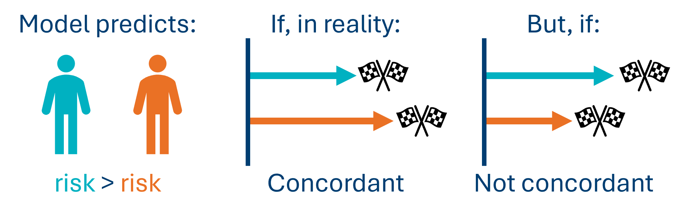

```{r}
#| echo: false
#| message: false
#| results: hide
source(file = "setup_files/setup.R")
```

```{python}
#| echo: false
#| message: false
#| results: hide
exec(open('setup_files/setup.py').read())
import shutup;shutup.please()
```

Last chapter, we fitted a simple Cox model with one continuous predictor.

In this chapter, we'll focus on how to judge the quality of that Cox model, and how to assess whether the assumptions of Cox regression were met.

## Libraries and functions

:::: {.callout-note collapse="true"}
## Click to expand

::: {.panel-tabset group="language"}
## R

```{r, load libraries}
#| eval: false
# load the required packages for fitting & visualising
library(tidyverse)
library(survival)
library(survminer)
```

## Python

```{python, import packages}
#| eval: false
import numpy as np
import pandas as pd
from lifelines import *
import matplotlib.pyplot as plt
from lifelines.statistics import multivariate_logrank_test
from lifelines.statistics import pairwise_logrank_test
```
:::
::::

## The model

Very briefly, let's recreate the model from last chapter using our `hospital_stays.csv` dataset.

If it's already in your global environment, you can skip this step.

::: {.panel-tabset group="language"}
## R

```{r, read in hosp_stays}
#| message: false
#| warning: false

hospital_stays <- read_csv("data/hospital_stays.csv")

cox_hosp <- coxph(Surv(time, discharged) ~ age,
                  data = hospital_stays)

summary(cox_hosp)
```
:::

Last chapter, we looked at:

- The significance of the individual `age` predictor
- Global significance tests for the model as a whole
- How to understand the hazard ratio

However, interpreting all of those numbers and tests from the model summary requires us to be confident that this model is the *right choice* for these data. How can we assess whether that's the case?

## Concordance

One of the numbers in the output that we can use is concordance. This is a measure of goodness-of-fit, or predictive accuracy. It's analogous to (but not quite the same as) $R^2$ in linear models.

It is calculated by taking each possible pair of individuals in the dataset and ranking their actual survival times, and then comparing it to what the model predicted their risks/survival times to be.

So, if the model predicted that patient A had a higher risk than patient B of experiencing the event based on their values of the predictor variable(s), and patient A also experienced the event sooner than patient B in reality, this would be a "concordant" pair.

{fig-align="center" width="1500"}

Each possible pair in the dataset is checked; so if a dataset contains 20 observations, this means 190 pairwise comparisons.

If the model gets everything completely perfect, we would see a concordance of 1. If the model is doing no better than random guessing, we would see a concordance of 0.5.

A concordance of around 0.7 as we see in our model above suggests that for a randomly selected pair of patients, the model correctly predicts who is discharged first 70% of the time.

In other words, concordance measures how good the model is at ordering individuals, in terms of when they are likely to experience the event of interest.

## Assumptions

Like any type of statistical model, a Cox regression makes assumptions about the data and experimental design. If they're not met, we shouldn't trust the model, even (especially!) if the numbers in the output look tempting.

Some assumptions are carried through from regular linear modelling and will be familiar; others are new for survival data.

- Independent observations
- Linearity
- Proportional hazards
- Non-informative censoring

The independence assumption was discussed in @sec-independence of a previous chapter, so we won't repeat it here, but you should go back and review that if you feel unsure about it.

The final two assumptions are unpacked later on in subsequent chapters, with some discussion/pointers on what you can do if they're not met.

For this chapter, we will focus just on linearity.

## Linearity

Although a Cox model is not itself linear, it does contain a linear bit in it, which we are transforming/embedding inside a non-linear equation. And we do still need that linear bit to actually be linear.

To put it more mathematically: we know that our predictor variables will not have a linear relationship directly with the hazard, or with the time-to-event; but they should have a linear relationship with the *log* of the hazard.

So, if you plotted the predictor variable against the log hazard, we expect a straight line.

We only need to concern ourselves with linearity for continuous predictors (not categorical ones).

### Martingale residuals plots

The most common method for checking linearity in Cox regression is by plotting something called the Martingale residuals.

We do this separately for each continuous predictor. So, if your model contains three continuous predictor variables, you would need three separate Martingale plots.

You don't really need to know what Martingale residuals are, just how to interpret the plot.

::: {.callout-note collapse="true"}
#### What should the Martingale plot look like?

If the linearity assumption holds for a continuous predictor, then the plot will show a roughly straight (linear) trend line. There might be some wiggles and bumps, but they aren't a systematic/clear trend.

Another way to phrase it is that we want the plot to have a monotonic trend. This means that the gradient of the line is either always decreasing, or always increasing (i.e., the line doesn't start going one direction and then change to go another).

Here are two examples of "good" Martingale plots.

These are perhaps the best you're likely to see, especially the first one. Notice how the trend lines aren't perfectly straight in either case, but the wobbles and bumps look just like random noise, rather than anything "real".

```{r, good martingale plots and data sim}
#| echo: false
#| message: false
#| warning: false

n <- 300
x_good <- rnorm(n)

# True linear effect
beta <- 0.8
linpred <- beta * x_good

# Simulate survival times (exponential baseline hazard)
time_good <- rexp(n, rate = exp(linpred))
status_good <- rbinom(n, 1, 0.8)  # some censoring

data_good <- data.frame(time = time_good,
                        status = status_good,
                        x = x_good)

x_bad <- rnorm(n)

# Non-linear (quadratic) effect
linpred_bad <- 1.2 * (x_bad^2)

time_bad <- rexp(n, rate = exp(linpred_bad))
status_bad <- rbinom(n, 1, 0.8)

data_bad <- data.frame(time = time_bad,
                       status = status_bad,
                       x = x_bad)

x_good2 <- rnorm(n)

# Mostly linear, with a bit of noise
linpred_good2 <- 0.7 * x_good2 + rnorm(n, sd = 0.3)

time_good2 <- rexp(n, rate = exp(linpred_good2))
status_good2 <- rbinom(n, 1, 0.75)

data_good2 <- data.frame(time = time_good2,
                         status = status_good2,
                         x = x_good2)

x_bad2 <- rnorm(n)

# Mild non-linearity: linear + small quadratic term
linpred_bad2 <- 0.6 * x_bad2 + 0.4 * (x_bad2^2)

time_bad2 <- rexp(n, rate = exp(linpred_bad2))
status_bad2 <- rbinom(n, 1, 0.75)

data_bad2 <- data.frame(time = time_bad2,
                        status = status_bad2,
                        x = x_bad2)

ggcoxfunctional(Surv(time, status) ~ x, data = data_good)
ggcoxfunctional(Surv(time, status) ~ x, data = data_good2)
```

Below are two examples of "bad" plots.

Again, the first is very exaggerated; the second is less extreme, but still has a clear turn in it that isn't just a random wiggle, but a systematic trend (in this case, a U-shape).

In both of these cases, we would probably want to perform some kind of transformation for our predictor variable, because the linearity assumption is clearly violated.

```{r, bad martingale plots}
#| echo: false
#| message: false
#| warning: false
#| 
ggcoxfunctional(Surv(time, status) ~ x, data = data_bad)
ggcoxfunctional(Surv(time, status) ~ x, data = data_bad2)
```
:::

So, how are these Martingale residual plots produced?

::: {.panel-tabset group="language"}
## R

The `survminer` package comes built-in with a function for producing the Martingale residual plots.

Here it is, applied to our continuous `age` predictor variable:

```{r, martingale residuals plot}
ggcoxfunctional(Surv(time, discharged) ~ age,
                  data = hospital_stays)
```

This function automatically creates a plot for each of the continuous predictors specified. In our example we only have one, `age`.

On each plot, there will be a trend line; we would like this line to be as close as possible to a single, straight trend line (like we would get in a simple linear regression).

If the line has strong bends, wiggles or turning points (e.g., it is U-shaped or S-shaped) this is generally a sign that we need to transform our predictor variable before we include it in the model.

Our line above is not perfectly straight, but it is always decreasing, with no super dramatic turns.

This is a pretty good plot! It's likely that the linearity assumption is met.
:::

## Time-varying predictors

It's worth noting that all of the examples we've discussed in this course so far feature predictors that do not vary with time.

For example, whether a patient is male or female, or what age they were when they were admitted to hospital, does not change during the course of the time they're being observed.

In all of our examples, we are also assuming that the *effect* of the predictors on the probability of the event occurring also does not vary with time.

For example, we assume that a patient being male has the same effect on their chance to be discharged from hospital on day 1, as it does on day 30.

These are two related, but distinct ideas:

- Time-varying **predictors**
- Time-varying **effects** of predictors

There will be a bonus chapter later that addresses how to deal with situations where predictors vary with time.

If the effect of a predictor varies with time, this will cause a violation of the proportional hazards assumption, mentioned above. Again, we will talk about this more in a subsequent chapter.

## Comparing to the log-rank test

So far in this chapter, we've used Cox regression to model continuous predictors, but it also works for categorical predictors too.

Let's recreate one of the analyses from a previous chapter, where we performed a log rank test on the `hospital_stays` dataset, for the `surgery` predictor, and compare it to a Cox regression with `surgery` as a predictor.

::: {.panel-tabset group="language"}
## R

```{r, log rank vs cox regression}
survdiff(Surv(time, discharged) ~ surgery, data = hospital_stays)

cox_surgery <- coxph(Surv(time, discharged) ~ surgery,
                  data = hospital_stays)

summary(cox_surgery)
```
:::

The numbers are not identical, but pretty similar! This isn't an accident.

In particular, the log rank test is effectively recreating the score test (at the bottom of the Cox regression output).

There are *tiny* differences in how the two tests calculate things, but they are achieving essentially the same thing.

So the log rank test behaves a little bit like a special case of Cox regression, in the same way that a t-test is a special case of a linear model.

## Summary

Like with any statistical model, we must be careful to assess the quality of a Cox regression model before interpreting its output, to determine our level of confidence and trust.

In particular, we should make sure to think about the model assumptions. If they're not met, we should proceed extremely cautiously with any interpretation.

::: callout-tip
#### Key Points

- We can use concordance to assess the goodness-of-fit of our Cox regression model
- Cox regression makes several assumptions about the dataset and the relationship between variables
- One of these assumptions is about linearity, which we can test with Martingale residual plots
:::
