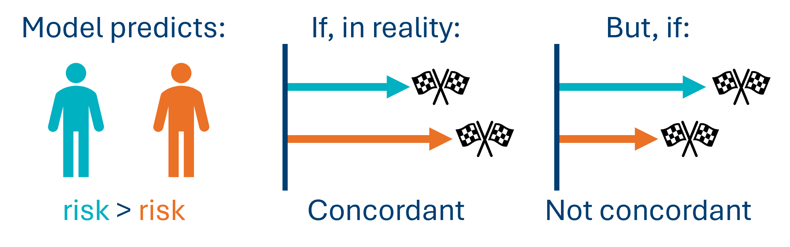
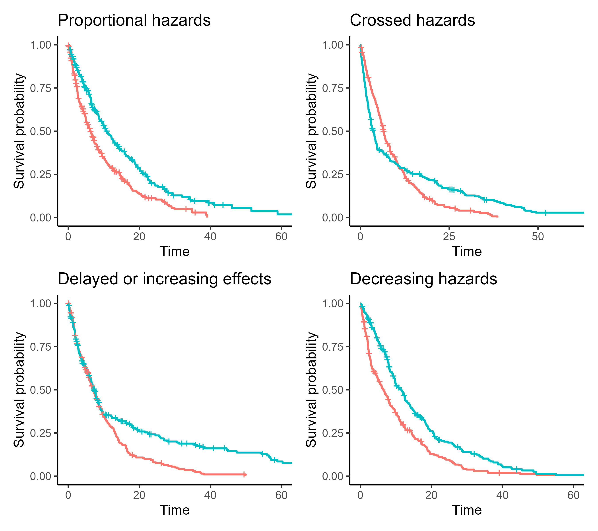

```{r}
#| echo: false
#| message: false
#| results: hide
source(file = "setup_files/setup.R")
```

```{python}
#| echo: false
#| message: false
#| results: hide
exec(open('setup_files/setup.py').read())
import shutup;shutup.please()
```

Last chapter, we fitted a simple Cox model with one continuous predictor.

In this chapter, we'll focus on how to judge the quality of that Cox model, and how to assess whether the assumptions of Cox regression were met.

::: {.callout-warning icon="false"}
Note that this chapter only features code in R. We hope to update it in future to include Python.
:::

## Libraries and functions

:::: {.callout-note collapse="true"}
## Click to expand

::: {.panel-tabset group="language"}
## R

```{r, load libraries}
#| eval: false
# load the required packages for fitting & visualising
library(tidyverse)
library(survival)
library(survminer)
```

## Python

```{python, import packages}
#| eval: false
import numpy as np
import pandas as pd
from lifelines import *
import matplotlib.pyplot as plt
from lifelines.statistics import multivariate_logrank_test
from lifelines.statistics import pairwise_logrank_test
```
:::
::::

## The models

Very briefly, let's recreates two models from previous chapters using our `hospital_stays.csv` dataset, which we'll use to practice testing assumptions.

(If these are both in your environment already, you don't need to re-create them.)

::: {.panel-tabset group="language"}
## R

```{r, read in hosp_stays}
#| message: false
#| warning: false

hospital_stays <- read_csv("data/hospital_stays.csv")

cox_hosp_age <- coxph(Surv(time, discharged) ~ age,
                  data = hospital_stays)

surv_hosp_surgery <- survfit(Surv(time, discharged) ~ surgery,
                      data = hospital_stays)
```
:::

Last chapter, we looked at:

- The significance of the individual `age` predictor
- Global significance tests for the model as a whole
- How to understand the hazard ratio

However, interpreting all of those numbers and tests from the model summary requires us to be confident that this model is the *right choice* for these data. How can we assess whether that's the case?

## Concordance {#sec-concordance}

One of the numbers in the output that we can use is concordance. This is a measure of goodness-of-fit, or predictive accuracy. It's analogous to (but not quite the same as) $R^2$\$R\^2\$\$R\^2\$ in linear models.

It is calculated by taking each possible pair of individuals in the dataset and ranking their actual survival times, and then comparing it to what the model predicted their risks/survival times to be.

So, if the model predicted that patient A had a higher risk than patient B of experiencing the event based on their values of the predictor variable(s), and patient A also experienced the event sooner than patient B in reality, this would be a "concordant" pair.

{fig-align="center" width="1500"}

Here's how concordance is calculated:

- Each possible pair in the dataset is checked; so, if a dataset contains 20 observations, this means 190 pairwise comparisons.
- If the model gets everything completely perfect, we would see a concordance of 1.
- If the model is doing no better than random guessing, we would see a concordance of 0.5.

Let's take a look at the concordance for our Cox regression model with `age` as a predictor.

::: {.panel-tabset group="language"}
## R

```{r, check concordance for age coxhosp}
summary(cox_hosp_age)
```

You can also extract the concordance directly with the `$` syntax:

```{r, directly check concordance for age coxhosp}
summary(cox_hosp_age)$concordance
```
:::

A concordance of around 0.7 as we see in our model above suggests that for a randomly selected pair of patients, the model correctly predicts who is discharged first 70% of the time.

In other words, **concordance measures how good the model is at ordering individuals**, in terms of when they are likely to experience the event of interest.

## Assumptions

Like any type of statistical model, a Cox regression makes assumptions about the data and experimental design. If they're not met, we shouldn't trust the model, even (especially!) if the numbers in the output look tempting.

Cox regression has some assumptions in common with the log-rank test, and these assumptions have already been explored in sufficient detail elsewhere:

- [Independent observations](#sec-independence)
- [Non-informative censoring](#sec-non-informative-censoring)

The others we will explore more here:

- Linearity (for continuous predictors)
- Proportional hazards

Here's a summary of the assumptions and the methods for checking them, for Cox regression.

+----------------------------------+------------------------------------------+----------------------------------------------------------------------+
| Method                           | Assumption                               | Predictor types                                                      |
+==================================+==========================================+======================================================================+
| Querying the experimental design | Independence & non-informative censoring | All predictors                                                       |
+----------------------------------+------------------------------------------+----------------------------------------------------------------------+
| Martingale residuals plots       | Linearity                                | Continuous only                                                      |
+----------------------------------+------------------------------------------+----------------------------------------------------------------------+
| Survival curves & log-log plots  | Proportional hazards                     | Categorical                                                          |
|                                  |                                          |                                                                      |
|                                  |                                          | (unhelpful for continuous predictors, unless you do some extra work) |
+----------------------------------+------------------------------------------+----------------------------------------------------------------------+
| Schoenfeld residuals plot        | Proportional hazards                     | All predictors                                                       |
|                                  |                                          |                                                                      |
|                                  |                                          | (often easier to read for continuous predictors, however)            |
+----------------------------------+------------------------------------------+----------------------------------------------------------------------+
| `cox.zph` test                   | Proportional hazards                     | All predictors                                                       |
+----------------------------------+------------------------------------------+----------------------------------------------------------------------+

## Linearity

Although a Cox model is not itself linear, it does contain a linear bit in it, which we are transforming/embedding inside a non-linear equation. And we do still need that linear bit to actually be linear.

To put it more mathematically: we know that our predictor variables will not have a linear relationship directly with the hazard, or with the time-to-event; but they should have a linear relationship with the *log* of the hazard.

So, if you plotted the predictor variable against the log hazard, we expect a straight line.

Note that we only need to concern ourselves with linearity for continuous predictors, as the assumption does not apply to categorical predictors.

### Martingale residuals plots

The most common method for checking linearity in Cox regression is by plotting something called the Martingale residuals.

We do this separately for each continuous predictor. So, if your model contains three continuous predictor variables, you would need three separate Martingale plots.

You don't really need to know what Martingale residuals are, just how to interpret the plot.

::: {.callout-note collapse="true"}
#### What should the Martingale plot look like?

If the linearity assumption holds for a continuous predictor, then the plot will show a roughly straight (linear) trend line. There might be some wiggles and bumps, but they aren't a systematic/clear trend.

Another way to phrase it is that we want the plot to have a monotonic trend. This means that the gradient of the line is either always decreasing, or always increasing (i.e., the line doesn't start going one direction and then change to go another).

Here are two examples of "good" Martingale plots.

These are perhaps the best you're likely to see, especially the first one. Notice how the trend lines aren't perfectly straight in either case, but the wobbles and bumps look just like random noise, rather than anything "real".

```{r, good martingale plots and data sim}
#| echo: false
#| message: false
#| warning: false

set.seed(712)

n <- 300
x_good <- rnorm(n)

# True linear effect
beta <- 0.8
linpred <- beta * x_good

# Simulate survival times (exponential baseline hazard)
time_good <- rexp(n, rate = exp(linpred))
status_good <- rbinom(n, 1, 0.8)  # some censoring

data_good <- data.frame(time = time_good,
                        status = status_good,
                        x = x_good)

x_bad <- rnorm(n)

# Non-linear (quadratic) effect
linpred_bad <- 1.2 * (x_bad^2)

time_bad <- rexp(n, rate = exp(linpred_bad))
status_bad <- rbinom(n, 1, 0.8)

data_bad <- data.frame(time = time_bad,
                       status = status_bad,
                       x = x_bad)

x_good2 <- rnorm(n)

# Mostly linear, with a bit of noise
linpred_good2 <- 0.7 * x_good2 + rnorm(n, sd = 0.3)

time_good2 <- rexp(n, rate = exp(linpred_good2))
status_good2 <- rbinom(n, 1, 0.75)

data_good2 <- data.frame(time = time_good2,
                         status = status_good2,
                         x = x_good2)

x_bad2 <- rnorm(n)

# Mild non-linearity: linear + small quadratic term
linpred_bad2 <- 0.6 * x_bad2 + 0.4 * (x_bad2^2)

time_bad2 <- rexp(n, rate = exp(linpred_bad2))
status_bad2 <- rbinom(n, 1, 0.75)

data_bad2 <- data.frame(time = time_bad2,
                        status = status_bad2,
                        x = x_bad2)

ggcoxfunctional(Surv(time, status) ~ x, data = data_good)
ggcoxfunctional(Surv(time, status) ~ x, data = data_good2)
```

Below are two examples of "bad" plots.

Again, the first is very exaggerated; the second is less extreme, but still has a clear turn in it that isn't just a random wiggle, but a systematic trend (in this case, a U-shape).

In both of these cases, we would probably want to perform some kind of transformation for our predictor variable, because the linearity assumption is clearly violated.

```{r, bad martingale plots}
#| echo: false
#| message: false
#| warning: false
ggcoxfunctional(Surv(time, status) ~ x, data = data_bad)
ggcoxfunctional(Surv(time, status) ~ x, data = data_bad2)
```
:::

So, how are these Martingale residual plots produced?

::: {#sec_linearity-hospstays-1 .panel-tabset group="language"}
## R

The `survminer` package comes built-in with a function for producing the Martingale residual plots.

Here it is, applied to our continuous `age` predictor variable:

```{r, martingale residuals plot}
#| message: false
ggcoxfunctional(cox_hosp_age, type = "martingale")
```

This function automatically creates a plot for each of the continuous predictors specified. In our example we only have one, `age`.

On each plot, there will be a trend line; we would like this line to be as close as possible to a single, straight trend line (like we would get in a simple linear regression).

If the line has strong bends, wiggles or turning points (e.g., it is U-shaped or S-shaped) this is generally a sign that we need to transform our predictor variable before we include it in the model.

Our line above is not perfectly straight, but it is always decreasing, with no super dramatic turns.

This is a pretty good plot! It's likely that the linearity assumption is met.
:::

:::: {.callout-important collapse="true"}
#### Caveats and common issues {#sec-martingale-caveats}

Producing these Martingale plots does not always go smoothly.

If you attempt to run the `ggcoxfunctional` functional and get an error, you might find that one of the two issues is at play:

1.  You have a categorical predictor; this function/method only works for continuous predictors
2.  There are missing values of your continuous predictor in the dataset

If you're facing issue #2, there is something you can do to fix it.

Let's imagine that there are missing values of `age` in our `hospital_stays` dataset. Here's how we could tackle that to still produce a Martingale residuals plot of the type shown above:

::: {.panel-tabset group="language"}
## R

First, we create a new version of the dataset with all missing values removed.

```{r, removing NAs for Martingale demo}
#| message: false
hospital_stays_narm <- na.omit(hospital_stays)
```

Then, we can refit the model using this reduced dataset, and from there, run `ggcoxfunctional` successfully.

```{r, removing NAs for Martingale demo create plot}
#| message: false
cox_hosp_narm <- coxph(Surv(time, discharged) ~ age, data = hospital_stays_narm)

ggcoxfunctional(cox_hosp_narm, data = hospital_stays_narm)
```
:::

(In this example, the plot looks identical, because we didn't actually have any missing values!)
::::

## Proportional hazards

In a [previous section](#sec-proportional-hazards-1), the idea of proportional hazards was introduced in the context of the log-rank test.

Cox regression includes proportional hazards as a formal assumption, so we'll go over it in more detail here, along with several different methods for checking it.

### What are proportional hazards?

The formal definition of proportional hazards is that the ratio of the hazard rates between any two groups, or between any two individuals, remains constant over time.

In the context of a categorical predictor, for example:

So, if group A has double the risk of death compared to group B on day 1, then they must also have double the risk of death on day 2, day 10, day 100, and so on.

In the context of a continuous predictor:

If individual A, with a value of the predictor variable that is 1 unit higher than individual B, has twice the risk of death on day 1, they must also have twice the risk on day 2, day 10, day 100, and so on.

### Inspecting the survival curves

One of the easiest methods for checking proportional hazards quickly is via the survival curves themselves.

This is most effective when the dataset is large enough to produce curves that are quite smooth; in smaller datasets, the "staircase" effect is stronger, and curves will often naturally look like they're criss-crossing even when the hazards are actually proportional.



However, examining the survival curves like this is only really helpful for categorical predictors - as we [discussed last chapter](#sec-continuous-curves), things get tricky with continuous predictors such as `age`.

Just to get a sense of how we *could* use this visual approach, let's examine a model that uses `surgery` instead of `age` as a predictor.

::: {#sec_prophaz-hospstays-1 .panel-tabset group="language"}
## R

Note: we have to use the `survfit` function, rather than the `coxph` function, to create an object that can then be passed to the `ggsurvplot` function.

However, once we've checked the proportional hazards, we could run `coxph(Surv(time, discharged) ~ surgery` just fine - check out the [second exercise from last chapter](#sec-exr_cox-vs-logrank) for the proof!

```{r, create coxph for surgery predictor}
#| message: false 
hosp_surgery_surv <- survfit(Surv(time, discharged) ~ surgery, data = hospital_stays) 

ggsurvplot(hosp_surgery_surv)
```
:::

I'd say those curves look pretty good! There's no obvious crossing over, delays, or "catching up" that would raise any red flags just from the eye test.

#### Log-log plots

Sometimes, it's helpful to have a "second view" of our survival curves - for example, creating a log-log survival curves.

These curves have the logarithm of time on the x-axis, and the logarithm of survival probability on the y-axis (instead of the raw time and survival probability).

You are hoping to see **approximately parallel log-log curves**, if the hazards truly are proportional.

As with the regular survival curves, however, this doesn't work very well for a continuous predictor like `age` - here's the proof:

::: {.panel-tabset group="language"}
## R

Re-fit the model using `survfit` instead of `coxph`:

```{r, refit cox age model with survfit}
hosp_age_surv <- survfit(Surv(time, discharged) ~ age, data = hospital_stays)
```

Then, make use of the `plot` function combined with a specific `fun = "cloglog` argument:

```{r, cloglog check ph for age}
plot(hosp_age_surv, fun = "cloglog")
```
:::

In our log-log plot above, it's kind of hard to tell whether the lines are parallel or not, because there's so many of them and they intersect with each other. Not helpful.

Here's the log-log survival plot for a Cox regression with `surgery` instead of `age` as a predictor, where this visual approach is much more helpful:

::: {.panel-tabset group="language"}
## R

```{r, cloglog check ph for surgery}
#| echo: false
#| message: false

plot(hosp_surgery_surv, fun = "cloglog")
```
:::

This looks pretty good! Our two log-log survival curves stratified by `surgery` look more or less parallel, give or take a bit of noisiness as you would expect to see.

### Schoenfeld residuals

For a different approach that doesn't rely on survival curves - and is therefore much more applicable to continuous predictors - we can examine something called the Schoenfeld residuals.

These residuals are calculated **per event** (or, per row of the dataset, excluding censored individuals). Broadly speaking, they capture the difference between:

- the actual observed value of the predictor(s) for the individual when they experienced the event
- the expected value of the predictor(s) if the model were correct

When we plot these residuals, we want to see **no systematic pattern** in the residuals at all. We're looking for a cloud of data points with no correlation, with a trend that is flat around 0.

This is very similar to what we're looking for in a residual plot for a standard linear model.

Let's visualise the Schoenfeld residuals for our Cox regression with `age` as a predictor:

::: {.panel-tabset group="language"}
## R

The `ggcoxdiagnostics` function from the `survminer` package can be used to produce Schoenfeld residuals plots without any extra work needed from you.

Make sure to set the `type` argument equal to `"schoenfeld"`.

```{r}
#| message: false
ggcoxdiagnostics(cox_hosp_age, type = "schoenfeld")
```
:::

This looks good! The blue trend line is very close to the red "goal" line and there are no obvious patterns I can see in the cloud of black data points.

### The `cox.zph` function

For those using R and the `survival` package, there is a function designed to help with checking the proportional hazards assumption.

This works on any model

::: {.panel-tabset group="language"}
## R

```{r, demo cox.zph function}
cox.zph(cox_hosp_age)
```
:::

::: {.callout-tip collapse="true" icon="false"}
## Bonus: Cox regression is "semi-parametric"

If you do any of your own reading about the assumptions of Cox regression, you may encounter people describing it as "semi-parametric".

If you understood all the stuff in this assumptions section above this box, you don't really need to understand what this means, but if you're curious, here's a bit more explanation:

Standard linear models are **parametric**. They make assumptions about the distribution of the residuals (namely, that it is normal).

**Non-parametric tests** (e.g., Wilcoxon, Kruskal-Wallis) do not make these assumptions, hence why we use them when we have cause to believe things are not nicely normal.

In Cox regression, we fall somewhere in the middle, making assumptions about the nature of the distribution in some ways and not others.

There are no assumptions being made about the distribution of the raw time data itself, or about the shape of the baseline hazard function – these can look like anything.

However, we do make an assumption about the hazards being **proportional**, and that's where the parametric part comes in. Hence, "semi-parametric".
:::

## Exercises

### Lung cancer (revisited) {#sec-exr_lung-evaluation}

::::: callout-exercise


In the last chapter, you fitted several Cox regression models to the [lung cancer](#sec-exr_lung) dataset.

Now, we'll evaluate them!

For each of the three models (`age` alone, `wtloss` alone, and both), you should:

- Assess concordance
- Check the Martingale residuals to determine linearity
- Check the Schoenfeld residuals to assess proportional hazards

**Which of the three models is best, in your opinion?**

Note: when checking the Martingale residuals, you might need to return to [an earlier section](#sec-martingale-caveats) in this chapter to help you work around an error!

:::: {.callout-answer collapse="true"}
#### Answers

::: {.panel-tabset group="language"}
## R

First, let's recreate the three models.

```{r}
#| message: false
lung <- force(lung)

lung_age_only <- coxph(Surv(time, status) ~ age, data = lung)
lung_wt_only <- coxph(Surv(time, status) ~ wt.loss, data = lung)
lung_both <- coxph(Surv(time, status) ~ age + wt.loss, data = lung)
```

Then, we'll start by looking at their concordance scores.

I'm using `$concordance` to extract just the scores here, so as not to clog up the screen, but you can also print the full summary and read these values out from there.

```{r}
summary(lung_age_only)$concordance
summary(lung_wt_only)$concordance
summary(lung_both)$concordance
```

They all have quite similar concordance scores, a little above the 0.5 chance level. The model with both predictors is the best of the three here.

Now, let's look at the Martingale residuals, for linearity.

```{r}
#| message: false
#| warning: false
ggcoxfunctional(lung_age_only)
```

For the `wt.loss` predictor, we find that there actually are some missing values, so we need to omit those rows and refit if we want to construct a Martingale residuals plot:

```{r}
# Remove missing values
lung_narm <- na.omit(lung)

# Refit the models
lung_wt_only_narm <- coxph(Surv(time, status) ~ wt.loss, data = lung_narm)
lung_both_narm <- coxph(Surv(time, status) ~ age + wt.loss, data = lung_narm)

ggcoxfunctional(lung_wt_only_narm)
ggcoxfunctional(lung_both_narm)
```

You may notice two things:

- The Martingale plot for `wt.loss` looks much worse than the plot for `age`

- The `ggcoxfunctional` function for the model containing both predictors essentially just recreates the first two plots we already had; this is not a mistake! Each predictor is dealt with one at a time when producing this kind of plot; this means that checking the Martingale residuals is actually redundant for our third model

Finally, let's have a look at the Schoenfeld residuals, for proportional hazards.

```{r}
ggcoxdiagnostics(lung_age_only, type = "schoenfeld")
ggcoxdiagnostics(lung_wt_only, type = "schoenfeld")
ggcoxdiagnostics(lung_both, type = "schoenfeld")
```

Once again, we notice that the third plot essentially just creates the first two, and is redundant.

This time, though, the plot for `age` perhaps looks a little worse than for `wt.loss`, implying that while `age` has a more convincingly linear relationship with survival probability, `wt.loss` better fits the proportional hazards assumption.

In future chapters, we'll go into more detail about model comparison/selection, and models with multiple predictors.
:::
::::
:::::

## Summary

Like with any statistical model, we must be careful to assess the quality of a Cox regression model before interpreting its output, to determine our level of confidence and trust.

In particular, we should make sure to think about the model assumptions. If they're not met, we should proceed extremely cautiously with any interpretation.

::: callout-tip
#### Key Points

- We can use concordance to assess the goodness-of-fit of our Cox regression model
- Cox regression makes several assumptions about the dataset and the relationship between variables
- These assumptions include independence and non-informative censoring, as in a log-rank test
- A Cox-specific assumption is linearity, which we can test with Martingale residual plots
- Cox regression also requires proportional hazards, which can be assessed visually in several ways
:::
